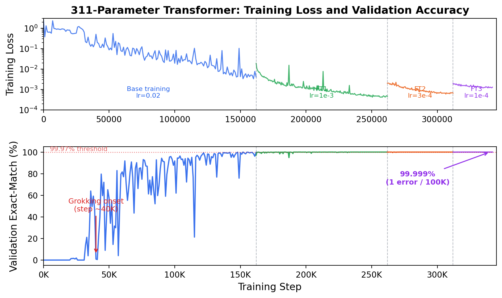

# Grokking 10-Digit Addition with a 311-Parameter Transformer

A **311-parameter** transformer that achieves **99.999% exact-match accuracy** on 100,000 test examples for 10-digit integer addition (1 error in 100K).

## Results

Evaluated on 10 independent test sets of 10,000 examples each (100,000 total), with seeds disjoint from training:

| Model | Params | Exact Match | Errors / 100K |
|---|---|---|---|
| **311p (seed 34 + fine-tuning)** | **311** | **99.999%** | **1** |

## Architecture

Single-layer, single-head, decoder-only transformer with d_model=4, d_ff=8, vocabulary size 14 (digits 0-9, `+`, `=`, `<PAD>`, `<EOS>`).

| Component | Factorization | Params |
|---|---|---|
| Token embedding (tied) | 14 × 4 | 56 |
| Position embedding (rank-3) | 33×3 + 3×4 | 111 |
| RMSNorm (pre-attn) | weight only | 4 |
| QKV (shareA_tieKV, r=3) | A: 4×3; Bq: 3×4; Bkv: 3×4 | 36 |
| Attention output (r=3) | 4×3 + 3×4 | 24 |
| RMSNorm (pre-FFN) | weight only | 4 |
| FFN up (r=3) | 4×3 + 3×8 | 36 |
| FFN down (r=3) | 8×3 + 3×4 | 36 |
| Final RMSNorm | weight only | 4 |
| Output head | (tied with token embedding) | 0 |
| **Total** | | **311** |

Building on [smallest-addition-transformer-codex](https://github.com/anadim/smallest-addition-transformer-codex) (1,644 params), [gpt-acc-jax](https://github.com/yhavinga/gpt-acc-jax) (777 params), and [digit-addition-491p](https://github.com/rezabyt/digit-addition-491p) (491 params), we reduce the model to **311 parameters** via:
- **Low-rank factorization** (W = AB, rank 3) for all weight matrices
- **RMSNorm** replacing LayerNorm (weight only, no bias)
- **Shared-A tied-KV QKV** (`shareA_tieKV`): Shared bottleneck matrix with tied K=V projection
- **Aggressive dimension reduction**: d_model from 7 to 4, d_ff from 14 to 8
- **Iterative fine-tuning**: 3 rounds of decreasing LR to push from ~97% to 99.999%

## Leaderboard

| Params | Model | Accuracy | Reference |
|---|---|---|---|
| 1,644 | Codex baseline | 99.04% | [Papailiopoulos](https://github.com/anadim/smallest-addition-transformer-codex) |
| 777 | gpt-acc-jax (pico-7d-ff14-lr02) | 99.69% | [Havinga](https://github.com/yhavinga/gpt-acc-jax) |
| 491 | + RMSNorm | 99.97% | [rezabyt](https://github.com/rezabyt/digit-addition-491p) |
| **311** | **+ shareA_tieKV + d_model=4 + fine-tuning** | **99.999%** | **This work** |

## Grokking + Fine-Tuning

The 311-parameter model exhibits **delayed grokking**: near-zero accuracy for ~35K steps, followed by a gradual rise to ~97% over 120K more steps. Three rounds of **iterative fine-tuning** with decreasing learning rates then close the remaining gap:

| Stage | LR | Steps | Errors / 100K |
|---|---|---|---|
| Base training | 0.02 | 162K | ~2,780 |
| Fine-tune 1 | 0.001 | 100K | 28 |
| Fine-tune 2 | 0.0003 | 50K | 9 |
| **Fine-tune 3** | **0.0001** | **30K** | **1** |



## Quick Start

### Install

```bash
pip install torch==2.10.0
```

### Evaluate Pre-trained Checkpoint

```bash
python evaluate_checkpoints.py \
  checkpoints/best_311p_s34.pt --device cuda
```

Expected output: 99,999 / 100,000 (1 error on seed 100).

### Single Prediction

```bash
python -m src.eval predict \
  --ckpt checkpoints/best_311p_s34.pt \
  --a 1234567890 --b 9876543210
```

### Train from Scratch

```bash
# Step 1: Base training (162K steps, seed sweep required)
python -m src.train \
  --run-name d4_r3_s34 --d-model 4 --d-ff 8 \
  --pos-rank 3 --qkv-rank 3 --attn-out-rank 3 --ffn-rank 3 \
  --use-rmsnorm --tie-qkv shareA_tieKV \
  --total-steps 162000 --device cuda --seed 34

# Step 2: Fine-tune round 1 (lr=0.001, 100K steps)
python finetune.py \
  --checkpoint results/d4_r3_s34/checkpoints/best.pt \
  --lr 0.001 --steps 100000 --seed 0

# Step 3: Fine-tune round 2 (lr=0.0003, 50K steps)
python finetune.py \
  --checkpoint <best_from_ft1>/checkpoints/best.pt \
  --lr 0.0003 --steps 50000 --seed 42

# Step 4: Fine-tune round 3 (lr=0.0001, 30K steps)
python finetune.py \
  --checkpoint <best_from_ft2>/checkpoints/best.pt \
  --lr 0.0001 --steps 30000 --seed 17
```

**Note:** Grokking is stochastic and hardware-dependent. Seed 34 is confirmed on A100 GPUs with CUDA 12.x. Always sweep seeds in a new environment.

## Training

3-phase curriculum following [gpt-acc-jax](https://github.com/yhavinga/gpt-acc-jax):
1. Steps 0-2,000: 1-3 digit operands
2. Steps 2,000-7,000: 1-6 digit operands
3. Steps 7,000+: 1-10 digit operands (full range)

AdamW optimizer, peak LR = 0.02, linear warmup (1,350 steps) + cosine decay, min LR = 0.002, weight decay = 0.01, batch size = 512, total steps = 162,000.

## Files

```
src/
  model.py    # Low-rank transformer (RMSNorm, shareA_tieKV, LowRankLinear)
  data.py     # Raw digit tokenization pipeline
  train.py    # Training with curriculum learning
  eval.py     # Evaluation and inference
checkpoints/
  best_311p_s34.pt   # Best model (311 params, 99.999% on 100K)
evaluate_checkpoints.py  # Multi-seed evaluation script
finetune.py              # Fine-tuning from a saved checkpoint
report.pdf               # Technical report
```

## References

- D. Papailiopoulos, "Glove box challenge: smallest transformer for 10-digit addition," 2026. [GitHub](https://github.com/anadim/smallest-addition-transformer-codex)
- Y. Havinga, "gpt-acc-jax: Smallest GPT for 10-digit addition," 2026. [GitHub](https://github.com/yhavinga/gpt-acc-jax)
- rezabyt, "digit-addition-491p," 2026. [GitHub](https://github.com/rezabyt/digit-addition-491p)
